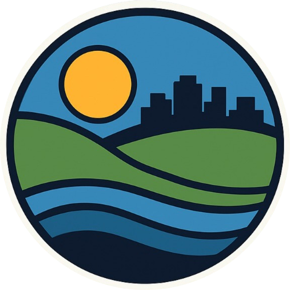

<div>
<h1 style="display: inline-block;">CLAR</h1>

</div>
NASA space apps hackathon submission in the Data Pathways to Healthy Cities and Human Settlements 
challenge. We are aiming to help the urban planners by providing important data for decision making.

## Used APIs
- GIBS from NASA for the temperature, air pollution and flood risk map overlays
- Openstreet map to get the closest critical infrasctructure
- Waqi - world map real time air quality index 

## To run the project
- Clone the repo with 
```console 
git clone https://github.com/AndriiYevmenchuk/CLAR-nasa.git
```
- Add a config.js with the line with your api key
```javascript
const MWP_API_KEY='<WAQI_API_KEY>'
```
